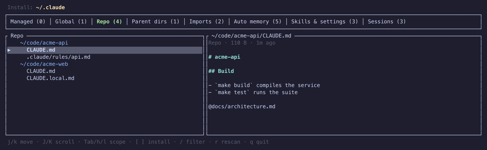

# claude-inspector

TUI to inspect Claude Code settings and context across config dirs.

- Started as a way to surface hidden memory
- Covers instruction files, imports, auto memory, skills, settings, and sessions

## Usage

- Run `make` to list build, run, and test targets
- Run `make run` to open the TUI

## Config dirs

- Honors `CLAUDE_CONFIG_DIR`, else `~/.claude`
- Add more with `-c <dir>` (repeatable), e.g. `make run ARGS="-c ~/.claude-me"`
- Sibling `~/.claude*` installs are auto-discovered; disable with `--no-discover`
